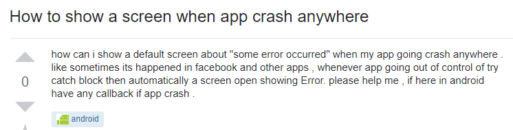

# StackOverflow

&nbsp;&nbsp;&nbsp;&nbsp;&nbsp;&nbsp;Whether it is someone who is an absolute beginner or even an experienced programmer, he has most likely visited---or at least heard of---a  website called [StackOverflow](https://stackoverflow.com/), a platform for questions and answers related to computer programming. 

&nbsp;&nbsp;&nbsp;&nbsp;&nbsp;&nbsp;When you want to find an answer to a question or problem that you have, the first thing you would do is use Google. Google then sends links to you related to your problem; most of the time the top searches will include StackOverflow links where a possible solution to your problem could have already been solved and answered by someone else. But what if no one else has even asked a question remotely close to your problem? Now it is time for you to ask the question yourself, and hopefully get some answers.

# Creating the Smart Question
&nbsp;&nbsp;&nbsp;&nbsp;&nbsp;&nbsp;We can just go ahead and start a thread and ask our question on StackOverflow. But if you are not careful in formulating your question, it can be shut down as quickly as you start it. In StackOverflow, certain user groups can vote to close down your question. Reasons as to why your question was closed could vary from your question being too vague to your question being a duplicate of another thread. 

&nbsp;&nbsp;&nbsp;&nbsp;&nbsp;&nbsp;But, what if for instance if your question was closed due to being considered a duplicate, that when you do go to the question that's considered the 'original' of your duplicate question, none of the solutions from that thread can be applied to your problem? Chances are, you need to formulate a new question in a smarter way so that it may be answered with possible solutions that are targeted specifically for your problem. 

### How To Ask Questions The Smart Way
&nbsp;&nbsp;&nbsp;&nbsp;&nbsp;&nbsp;Eric Steven Raymond wrote a useful and comprehensive essay that establishes guidelines for asking a smart question---[How To Ask Questions The Smart Way](http://www.catb.org/esr/faqs/smart-questions.html). Using these guidelines, let us look at a question that would satisfy the rules of what it means for a question to be a smart question. 

#### Smart Question
[findResource(“”) returning null when module-info.java is present, why is that?](https://stackoverflow.com/questions/51944963/findresource-returning-null-when-module-info-java-is-present-why-is-that)

&nbsp;&nbsp;&nbsp;&nbsp;&nbsp;&nbsp;Right off the bat, we can see that this question followed Eric Steven Raymond's guideline on using the format "object - deviation" for the title of the question. The object---"find resource("") returning null when module-info.java is present"---is concise and to the point. Although Eric's guidelines suggest specifying details such as IDE, OS, and any other environmental details in the title, it is redudant in StackOverflow as the website has "tags" where you can create tags for such details. We do see in this thread that the questioner does indeed make use of these tags by tagging the appropriate details such as "java," "spring-boot," "java-10," "java-module," and "jigsaw."

This question actually satisfies all of the following guideliness presented by Eric:
* Describe the symptoms of your problem or bug carefully and clearly.
* Describe the environment in which it occurs (machine, OS, application, whatever).
* Describe the research you did to try and understand the problem before you asked the question.
* Describe the diagnostic steps you took to try and pin down the problem yourself before you asked the question.
* If at all possible, provide a way to reproduce the problem in a controlled environment.

#### Not-So-Smart Question
Now let's look at what the opposite of a smart question looks like: [How to show a screen when app crash anywhere](https://stackoverflow.com/questions/52232981/how-to-show-a-screen-when-app-crash-anywhere).

&nbsp;&nbsp;&nbsp;&nbsp;&nbsp;&nbsp;Looking at this question, it is very obvious that English is not this person's first language. In this case, Eric Steven Raymond notes that the questioner should alert potential respondents about their language difficulties. The simple phrase "English is not my first language" would go a long way. 

&nbsp;&nbsp;&nbsp;&nbsp;&nbsp;&nbsp;However, I considered this particular question as an extreme example of language difficulties so I looked into this user's profile. Looking into this user's profile, it seems that this user can type in normal English just fine. Although his other StackOverflow questions and answers could use some more grammatical improvement, this user's English on other posts seem easier to read compared to this particular question that he posted. It seems like this user did not even try to formulate the question any way close to being a decent question. 

# Are smart questions rewarded?
&nbsp;&nbsp;&nbsp;&nbsp;&nbsp;&nbsp;Formulating a smart question is a crucial step to being able to receive the specific answer that you need and want for your problem. That being said, it seems people do not mind sharing a potential solution to a question regardless if it followed all of Eric Steven Raymond's guideliness. As long as it does not violate StackOverflow's rules on questions such as duplicates, off-topic, or blatant "debug and fix my code for me" questions, people will still most likely respond to your question, as is the case with the [How to show a screen when app crash anywhere](https://stackoverflow.com/questions/52232981/how-to-show-a-screen-when-app-crash-anywhere) question. Despite being a question that was worded poorly, three users still answered with solutions that even showed how to setup the solution.

&nbsp;&nbsp;&nbsp;&nbsp;&nbsp;&nbsp;However, that doesn't mean smart questions are not rewarded. Meticulously typed and smart questions are more likely to be given an effort to find a possible solution by a respondent, as is the case with our [smart question example](https://stackoverflow.com/questions/51944963/findresource-returning-null-when-module-info-java-is-present-why-is-that). One of the respondents in this question thread gave the effort to find a solution by recreating the example that was thorougly given by the questioner. Why? Because the questioner also gave the effort in reproducing the problem and giving the method of reproducing the problem for others to test. If this question was not as thoroughly typed out as it is, most respondents would most likely just look through the question and try to search other sources that could potentially lead to possible solutions. They most likely would not go as far as to test out an actual possible solution, which would be extremely helpful in this case where heavy debugging is involved.  
  
