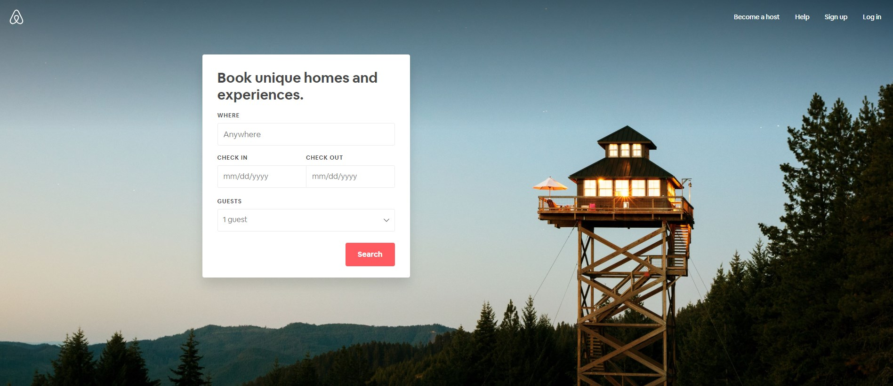

# UI Frameworks
Designing web pages may seem easy when you look at a lot of websites. In fact, many of the websites for big companies nowadays use minimalistic designs. A common recipe for such websites is a navigation bar, a footer, and a massive image that takes up the majority of the space on the page. Such an example would be the front page of [AirBnB](https://www.airbnb.com/) 
