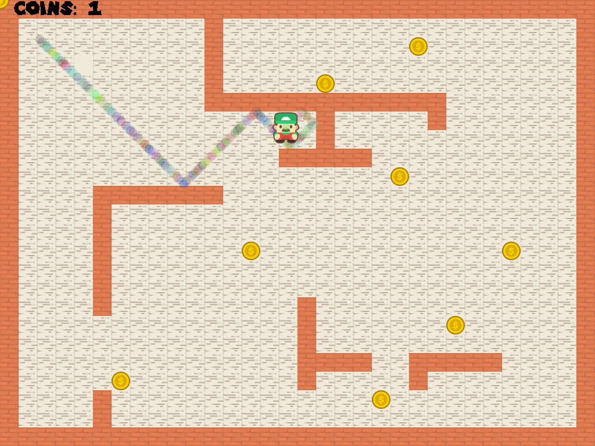

Roombrah is the second project I did for my ICS 111 class. It was a project specifically dealing with arrays and how to work with object collision using images. On the visual side of this program, the character Mario spawns on the top left of the map and continously moves around the screen. When he touches a wall, he bounces off of it, pushing him into the opposite direction. The program ends when Mario collects all the coins. 

There isn't much the user can do in this program; he can only run the program and watch Mario as he moves around the screen collecting the coins. The program is fixed so that it is guaranteed that Mario will collect all the coins. This project was solely focused on working with arrays and object collision on the back-end of development. 

Here is a snippet of the code from this program that places the coin images, background floor images, and wall images at the edges of the screen using simple arithmethic to spawn them in a grid-like pattern. 
```java
for(int row = 0; row < HEIGHT; row++) { 
	for (int column = 0; column < charInput.length(); column++) {
		char ch = charInput.charAt(column); 
		switch(ch) { 
		case 'W': 
			wallArray[wallArrayCount] = EZ.addImage("redwood.png", 16 + (column * 32), 16 + (row * 32)); 
			wallArrayCount++; 
			break; 
		case 'C': 
			coinArray[coinArrayCount] = EZ.addImage("coin.png", 16 + (column * 32), 16 + (row * 32));
			coinArrayCount++; 
			break; 
		case '.': 
			EZ.addImage("floor.png", 16 + (column * 32), 16 + (row * 32)); 
			break; 
		default: 
			break;
		} 
} 
```

In this project, I learned how to create a grid-like pattern on a screen using two FOR loops. Then I learned how to work with this grid by using some arithmethic to place images at the exact place I want them to be. With the images that were placed onto the screen, I learned how tell the program if the character has collided with either a coin image or a wall image.

Here is a [Youtube Demo](https://youtu.be/msCt_rNQeWY) of this project.

Source: <a href="https://github.com/gcalica/roombrah"><i class="large github icon"></i>gcalica/roombrah</a>
