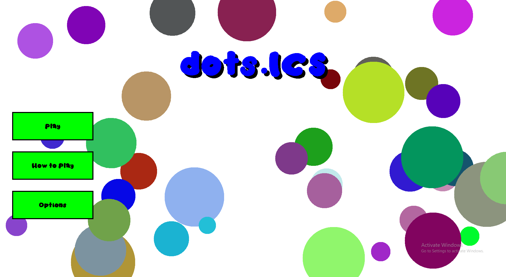

dots.ICS is the final project that my team of four created for our ICS 111 (Intro to Comp Sci.) class. It is based off of a web-based game called Agar.io.

In the game, the entity that the player controls with mouse direction is a Blob. And all around the map are tiny circles called Dots, which the Blob eats to grow in size. However, there are also enemy Blobs that can eat these Dots and become just as big, if not bigger, than the player. The player Blob can eat the enemy Blob if they are bigger than the enemy; likewise, the enemy Blobs can eat each other or the player if that enemy Blob is bigger in size. If the player eats one of the enemy Blobs, the player increases in size by how big the enemy Blob was that they just ate. 

There are also green entities called Viruses. If the player Blob or an enemy Blob touches one of the Viruses--and they are bigger in size than the Virus--then the Virus infects them, making them smaller.

The main goal of the game is for the player to control the Blob with the mouse, being the last Blob standing alive by eating all the other enemy Blobs. Otherwise, another enemy Blob will win the game if they eat all the other enemy Blobs and the player. 

In this project, I programmed the behavior and interaction of all the entities (Player Blobs & Enemy Blobs, Dots, and Viruses) with each other. I also designed and created the user interface for the beginning and endgame screens. As a final project for our ICS 111 class, I was able to have the opportunity to combine all the knowledge and skills I have learned from the past semester into this game. I utilized my knowledge in object-oriented programming to model the game and further expand my skill of being able to create and manipulate interaction between objects. 
 
Source: <a href="https://github.com/gcalica/dots.ICS"><i class="large github icon"></i>gcalica/dots.ICS</a>
