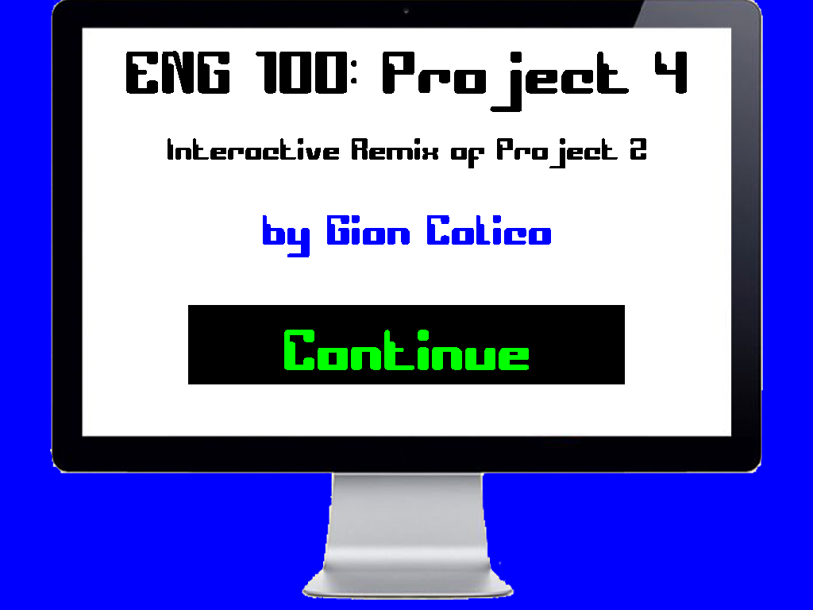

In my ENG 100 class, we wrote three papers prior to this project. As for this fourth project, we could "remix" any of our previous three
papers into a different form of creative medium. We could express a paper as a song, video, presentation, etc... 

My second paper that I wrote was about how computers and technology has made our lives easier, and their major role in our society. Rather than create a Microsoft Powerpoint, I decided that my creative outlet would be to code my own presentation slides that summarizes my second paper. 

In this program, you can click through the next or previous "slides" by clicking continue or back, respectively. The program is desgined to be interactive. In the first few slides, you can click the images that would play sounds. The other slides show and animate the capabilities that computers can do. 

This project has made me realize that the scope that programming touches isn't just limited to large scale apps or complex algorithims. But rather that programming is also an excellent form of medium to express your creativity in. It has its technical and computation side that we are familiar with, but there also exists a creative side to programming. I became interested in computers and programming when I realized that they are everywhere around us. And this project gave me the opportunity to express that interest by physically showing that interest itself--through coding this project. On the technical side of things, this project has taught me how to use a flowchart to maintain logic consistency throughout my program. I learned to make sure that moving to the next slide and then back to the previous slide shows the slide in its previous state it was in prior to moving to the next slide. 

Here is a [Youtube Demo](https://youtu.be/HeKGENRX3Sw) of the project.
Source: <a href="https://github.com/gcalica/ENG100Project4"><i class="large github icon"></i>gcalica/ENG100Project4</a>

