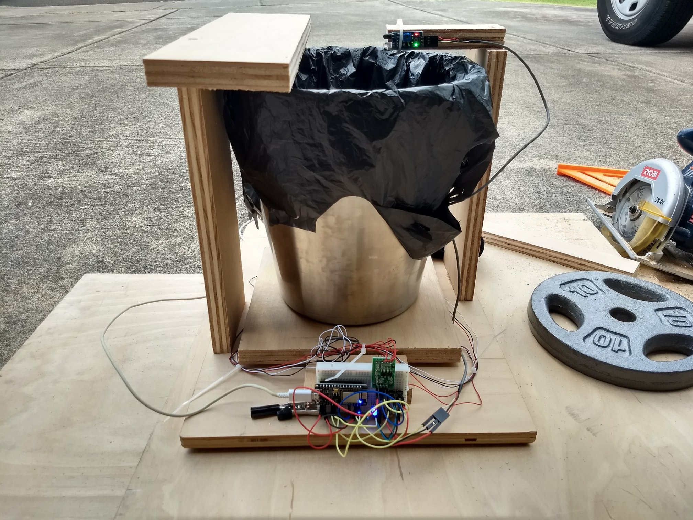
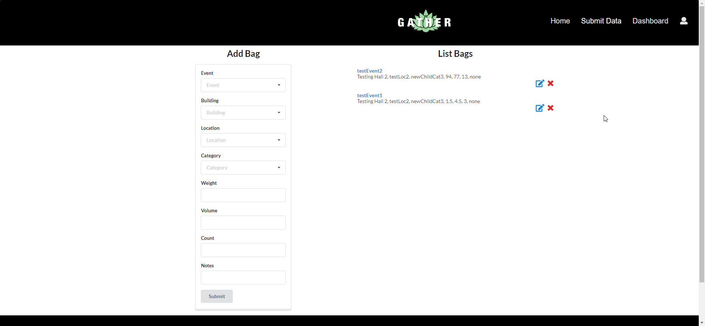
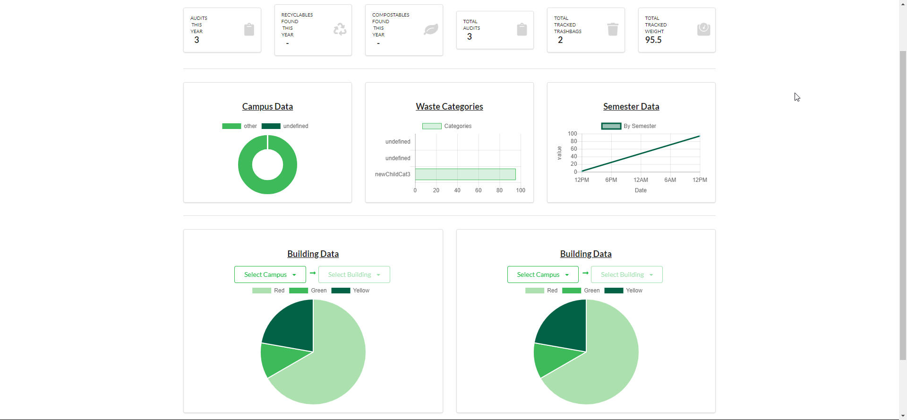

# Overview
&nbsp;&nbsp;&nbsp;&nbsp;&nbsp;&nbsp;On October 20, 2018, coders of all levels, from amateurs to working professionals, gathered around in the East-West Center on the University of Hawaii campus to attend the Hawaii Annual Code Challenge (HACC 2018). This year's theme for the hackathon was centered around the sustainability goals presented by the [Aloha Challenge Dashboard](https://dashboard.hawaii.gov/aloha-challenge). During the kickoff event, a total of seven different departments presented challenges that each department is facing and need help in. The challenge that my group decided to take on was the Office of Sustainability (UH)'s challenge on Waste Audit Data Collection.

&nbsp;&nbsp;&nbsp;&nbsp;&nbsp;&nbsp;University of Hawaii's Office of Sustainability is working to help the University of Hawaii(UH) campus to move towards a goal of a zero-waste policy. In order to figure out which areas the UH campus needs to improve in, the Office of Sustainability conducts Waste Audit events that are designed to observe and track the waste stream of the campuses. The Waste Audits provide valuable data to UH to help in making decisions to move towards the zero-waste policy.

# Waste Audit
&nbsp;&nbsp;&nbsp;&nbsp;&nbsp;&nbsp;Typically, one Waste Audit event relates to one of the UH campuses and several buildings of that campus. Of the several selected buildings for the Waste Audit event, the trash from each building is collected and sorted into different categories. These categories include paper, glass, metal, and plastic materials. The trash are sorted into trash bags based on their category and recorded. The weight and volume of each trash bag is recorded, which is the main data for the event.

&nbsp;&nbsp;&nbsp;&nbsp;&nbsp;&nbsp;The Waste Audit also encourages and invites students, community members, and volunteers as its workers for the event. This creates a positive environment of a group of people who are like-minded towards the goal of achieving a zero-waste policy for the campuses.

### Problem
&nbsp;&nbsp;&nbsp;&nbsp;&nbsp;&nbsp;Currently, data collection during the Waste Audit event is very inefficient. As it is, data collection for the Waste Audit is actually just pencil and paper, which can get pretty messy as trash is handled all over the place and sticky things can get onto the paper. Not only that, sorting the data is also very tedious and inefficient. After all the data has been recorded, the maintainer of the data has to input each data one by one into a spreadsheet. And then they also have to make the charts to visualize these data themselves.

### Solution
&nbsp;&nbsp;&nbsp;&nbsp;&nbsp;&nbsp;The problems can be solved by streamlining the Waste Audit data collection into a much more efficient and modern process. Our group provided a solution for this problem by creating a web application that did almost all of the work that the maintainer of the data collection had to do. We also created hardware to solve the part of the process where the Waste Audit volunteers had to record the data for each trash bag collected had been solved.

# GATHER

Our solution consisted of two parts:
* Hardware: the Smart Bin.
* Software: Our web application [GATHER](http://gather.meteorapp.com/#/)

### Smart Bin

&nbsp;&nbsp;&nbsp;&nbsp;&nbsp;&nbsp;With the old process of data collection, the Waste Audit volunteers had to write down the data for each trash bag. This included the respective category, weight, and volume for that trash bag. To solve this problem, a member of our team created a smart trash bin that could sense the weight and track the items that go inside the trash bin. The tracked data from the bin would then be sent over to the servers of our web application to be recorded and saved in the database. This contraption can also be expanded so that these trash bins can be placed all over campus, and students can actually sort and throw their trash into these bins to help contribute to the data collection.

### Web App
&nbsp;&nbsp;&nbsp;&nbsp;&nbsp;&nbsp;Besides the trash bin, there is also a manual process of recording the data from the Waste Audit into our web app.

In this page of our web application, the Waste Audit volunteers can manually enter the data for each trash bag that was sorted. This is a much more efficient process than the old pencil and paper as all data can be found in one centralized database--our web app.

&nbsp;&nbsp;&nbsp;&nbsp;&nbsp;&nbsp;Because the data from all of the conducted Waste Audits are centralized into one database, this allows us to create a powerful extension from the data that solves the last problem--which is being able to easily visualize the data collected. Our web application has a Dashboard page that gives an overview of the data collected from all previous Waste Audit events. There are also composition, comparison, and transition charts that help analyze the trend of waste streams of the UH campuses found during the Waste Audit events.

# My Contribution
&nbsp;&nbsp;&nbsp;&nbsp;&nbsp;&nbsp;I was assigned as one of the two back-end developers, responsible for creating the back-end structure of our web app. My tasks included creating the API of our web application, setting up our MongoDB database in mLab, and creating the collections ("tables" is the equivalent in SQL language) of our database. And the majority of my contributions were the Wrapper class on the server-side. The Wrapper class is a class of modules to be used by our front-end developers. The functions inside the Wrapper class all connect to our MongoDB database, and their primary function is to query and fetch data from the database. Our back-end was composed of many collections, therefore it was my job was to be able to query those data. These functions would then be used by our front-end programmers to render the data back into our web application.

&nbsp;&nbsp;&nbsp;&nbsp;&nbsp;&nbsp;Our web application used the Meteor web framework for the foundation and React for our front-end interface. In my case, I worked exclusively with Meteor and it was my first time truly using Meteor to its full potential. A lot of the problems that I encountered were related to Meteor and overall just having limited knowledge of the framework. Originally, I was only supposed to be a "Research Team" member for this group, which was just to research the libraries and how Meteor worked. I would then relay my findings to the actual front-end and back-end programmers for the project. However, I ended up being assigned to being a developer for the back-end with less than 10 days left before the due date. Despite my research into the Meteor framework prior, there was definitely a massive distinction in knowing the framework on the surface-level and actually being able to implement and use the framework. Despite having very little time available to do back-end development, I was able to learn and make most of the Wrapper class functions in time.

&nbsp;&nbsp;&nbsp;&nbsp;&nbsp;&nbsp;Overall, I learned and gained a lot of valuable experience from this hackathon. The most obvious is having learned both the Meteor and React frameworks. I also gained a much more familiar sense as to how to query data from a database and be able to manipulate that data into something usable. One more valuable experience that I also gained from this hackathon is working with a group. Prior to this hackathon, I had only experienced one coding group project for one of my courses. But there wasn't much "group" effort with that project. I had ended up doing almost all of the work for that project and I never truly experienced what it was like to work in a goal-driven project where tasks are actually delegated. For this project, we encountered many merge conflicts because we had seven group members working together. Through those merge conflicts, I was able to gain more knowledge of `git` and utilize git features such as `git rebase`, `git merge`, and `git stash`.

---
* Deployed Website: [GATHER](http://gather.meteorapp.com/#/)
* GitHub Repository: <a href="https://github.com/HACC2018/The-Johnson-Family"><i class="large github icon"></i>HACC2018/The-Johnson-Family</a>

