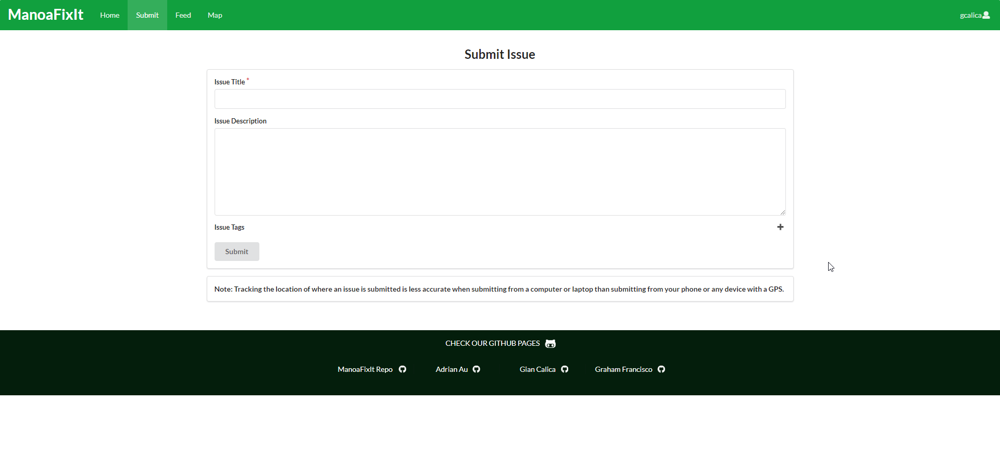
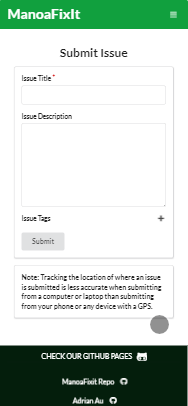
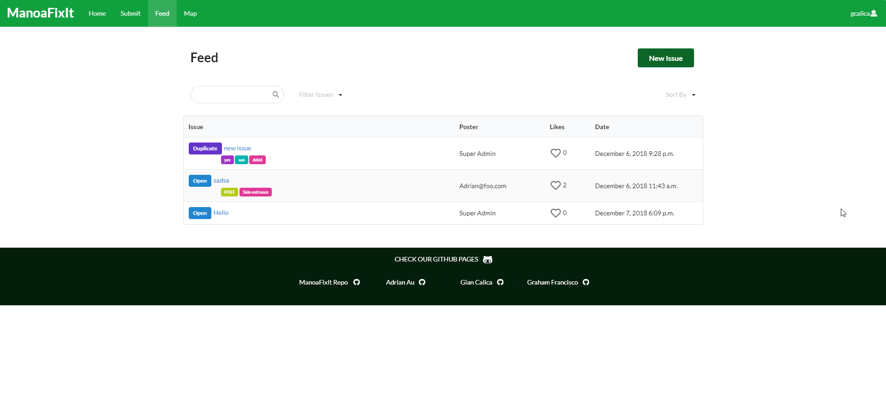
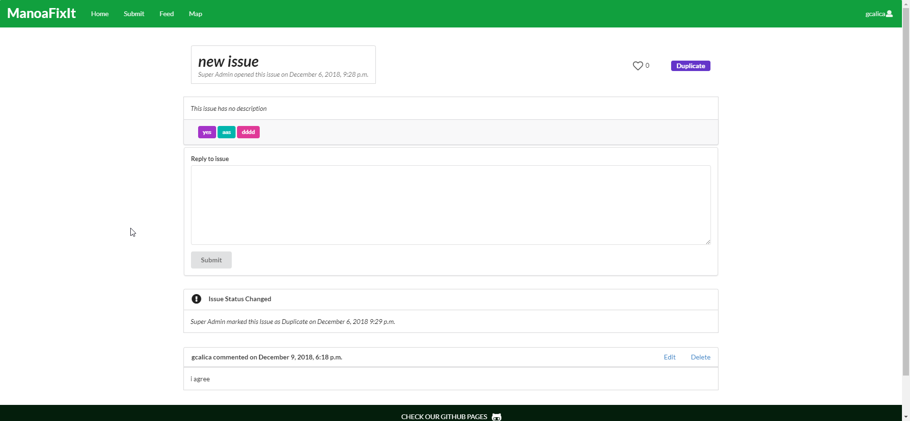
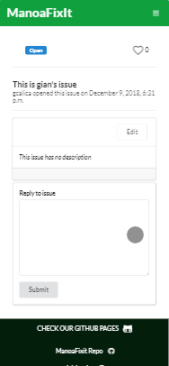
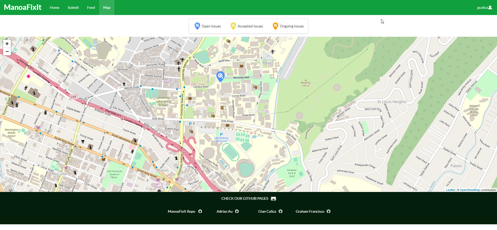
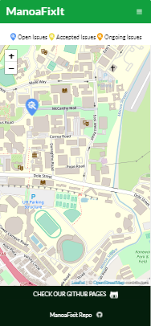

# Overview

### Problem
&nbsp;&nbsp;&nbsp;&nbsp;&nbsp;&nbsp;Currently, University of Hawaii at Manoa (UHM) does not have a quick and modern way to report any non-security related issues that students encounter on campus. There are hotline numbers for students to call, but the process of looking up and finding those numbers is a huge hassle and can even discourage students from reporting issues in the first place.

### Solution
&nbsp;&nbsp;&nbsp;&nbsp;&nbsp;&nbsp;Our team built a web application called [ManoaFixIt](https://manoafixit.meteorapp.com/#/) to solve this problem which is an app that allows any UHM community member to be able to report any issues they encounter on campus.

### Goals
&nbsp;&nbsp;&nbsp;&nbsp;&nbsp;&nbsp;When we built our app, we had two goals in mind:
* Make the web app mobile friendly
* Make it easy to use the app and there should be minimal effort to submit an issue

&nbsp;&nbsp;&nbsp;&nbsp;&nbsp;&nbsp;Obviously, when students want to report an issue, they would most likely report an issue using their mobile phones. No one is gonna pull out their entire laptop just to submit an issue. Therefore, we built our app to be very mobile friendly and compatible. And since the whole point of the app is to make the process of submitting an issue as less hassle as possible, we also built our app keeping in mind to make it very easy for the user to submit an issue and use our app with minimal effort.

# ManoaFixIt

#### Submitting an Issue

<i> Submitting Issue (Desktop) </i>

<i> Submitting Issue (Mobile) </i>

&nbsp;&nbsp;&nbsp;&nbsp;&nbsp;&nbsp;This page allows users to submit an issue that they encounter on campus. As you can see, only the Issue Title is required to submit an issue. This is to fulfill our second goal which is to make submitting an issue be very minimal effort.

#### List all Issues (Feed Page)

<i> Feed Page (Desktop) </i>

<i> Feed Page (Mobile) </i>

&nbsp;&nbsp;&nbsp;&nbsp;&nbsp;&nbsp;This page lists all of the issues that have been submitted. You can search for a particular issue title using the search bar, filter the issues according to a status (Issue Statuses: Open, Accepted, Ongoing, Resolved, and Duplicate), or sort the issues (by Newest, Oldest, Most Liked, and Least Liked). This page only gives you the brief info about that issue: the title, tags, its status, the poster of the issue, how many likes it has, and when the issue was opened. And if you created a particular issue, you can also delete that issue from this page. But if you click on the issue title from this page, it sends you to a page where you can view the full issue's information.

#### Individual Issue Pages

<i> Feed Page (Desktop) </i>

<i> Feed Page (Mobile) </i>

&nbsp;&nbsp;&nbsp;&nbsp;&nbsp;&nbsp;After clicking on a particular issue from the Feed page, it redirects you to that issue's individual page. This page gives all the information about the issue: title, description, tags, likes, and its status. From this page, you can click on "Edit Issue" to edit the issue if you were the poster of that issue (as seen from the mobile version picture). Likewise with the Feed page, you can also like the issue from this page.

&nbsp;&nbsp;&nbsp;&nbsp;&nbsp;&nbsp;Another feature with the issues is that in addition to be able to like an issue, you can also reply to that issue. 

#### Viewing all Issues on the Map (Map Page)

<i> Map Page (Desktop) </i>

<i> Map Page (Mobile) </i>

# My Contributions

---
* Deployed Website: [ManoaFixIt](https://manoafixit.meteorapp.com/)
* GitHub Repository: <a href="https://github.com/manoafixit/manoafixit"><i class="large github icon"></i>manoafixit/manoafixit</a>
* GitHub Organization Page: <a href="https://github.com/manoafixit/manoafixit.github.io"><i class="large github alternate icon"></i>ManoaFixIt</a>
* Development Timelapse Video: <a href="https://youtu.be/0p8vGvEfy8M">ManoaFixIt TImelapse</a>

