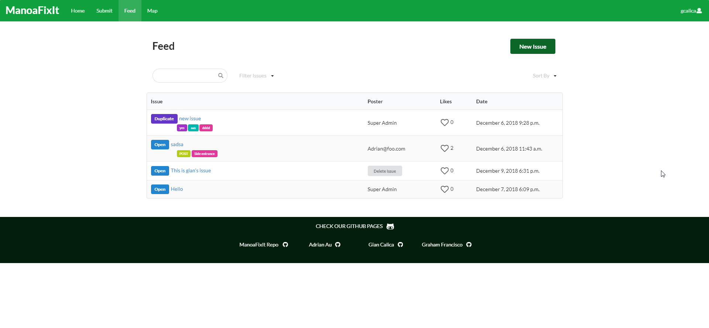
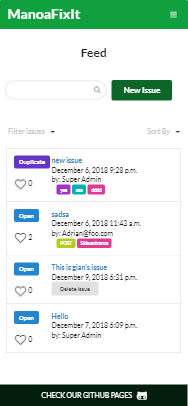

# Overview

### Problem
&nbsp;&nbsp;&nbsp;&nbsp;&nbsp;&nbsp;Currently, University of Hawaii at Manoa (UHM) does not have a quick and modern way to report any non-security related issues that students encounter on campus. There are hotline numbers for students to call, but the process of looking up and finding those numbers is a huge hassle and can even discourage students from reporting issues in the first place.

### Solution
&nbsp;&nbsp;&nbsp;&nbsp;&nbsp;&nbsp;Our team built a web application called [ManoaFixIt](https://manoafixit.meteorapp.com/#/) to solve this problem which is an app that allows any UHM community member to be able to report any issues they encounter on campus.

### Goals
&nbsp;&nbsp;&nbsp;&nbsp;&nbsp;&nbsp;When we built our app, we had two goals in mind:
* Make the web app mobile friendly
* Make it easy to use the app and there should be minimal effort to submit an issue

&nbsp;&nbsp;&nbsp;&nbsp;&nbsp;&nbsp;Obviously, when students want to report an issue, they would most likely report an issue using their mobile phones. No one is gonna pull out their entire laptop just to submit an issue. Therefore, we built our app to be very mobile friendly and compatible. And since the whole point of the app is to make the process of submitting an issue as less hassle as possible, we also built our app keeping in mind to make it very easy for the user to submit an issue and use our app with minimal effort.

# ManoaFixIt

#### Submitting an Issue

<i> Submitting Issue (Desktop) </i>

<i> Submitting Issue (Mobile) </i>

#### List all Issues (Feed Page)

<i> Feed Page (Desktop) </i>

<i> Feed Page (Mobile) </i>

#### Viewing all Issues on the Map (Map Page)

<i> Map Page (Desktop) </i>

<i> Map Page (Mobile) </i>

####
---
* Deployed Website: [ManoaFixIt](https://manoafixit.meteorapp.com/)
* GitHub Repository: <a href="https://github.com/manoafixit/manoafixit"><i class="large github icon"></i>manoafixit/manoafixit</a>
* GitHub Organization Page: <a href="https://github.com/manoafixit/manoafixit.github.io"><i class="large github alternate icon"></i>ManoaFixIt</a>
* Development Timelapse Video: <a href="https://youtu.be/0p8vGvEfy8M">ManoaFixIt TImelapse</a>

